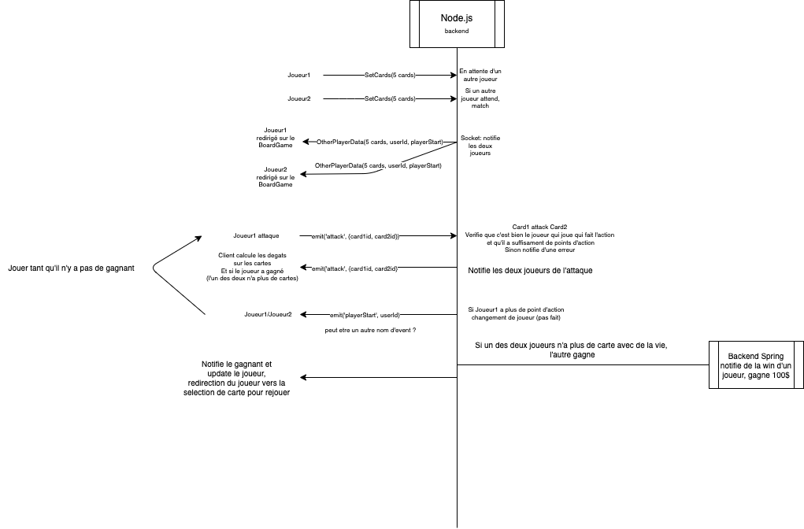

# Avantages/Inconvéniants de Node.js

## Avantages

- **Simplicité des communications**: La communication entre le front et le back est simplifiée par le fait que les deux sont en Javascript et que les objets sont les mêmes des deux côtés (json).
- **Harmonisation**: le developpement des socket se fait de maniere identique pour le front et le back grace a socket.io.
  ce qui offre une harmonisation du code.

## Inconvénients

- **Difficulté de débogage**: Node.js est un environnement asynchrone, ce qui peut rendre le débogage difficile.
- **Mono Thread**: Node.js est mono thread, ce qui peut poser des problèmes de performance si l'application est très gourmande en ressources.
- **Pas de type**: Javascript est un langage non typé, ce qui peut poser des problèmes de maintenabilité et de lisibilité du code. D'où l'utilisation de TypeScript dans notre projet.
- **Lourdeurs des dépendances**: Les dépendances de Node.js sont extremement lourdes, ce qui peut ralentir les builds et les déploiements.

# Diagramme de séquence du jeu

